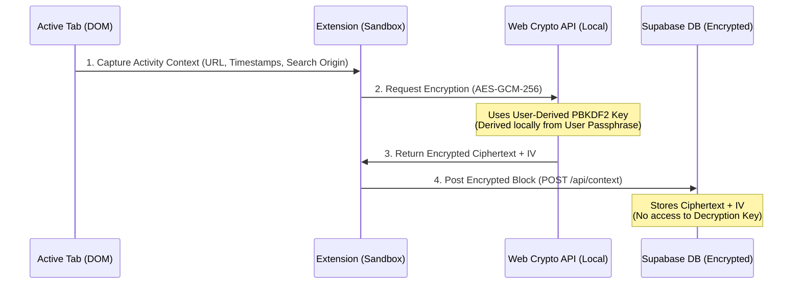

# Architecture & Design: Zero-Knowledge Context Capture & Conversational Query Logging

This document outlines the technical design for BookSmart's personal context layer: **Privacy-First Client-Side Context Capture** and **Multi-Turn Conversational Search Capture**.

---

## 🎯 1. The Core Vision
The BookSmart browser extension captures a rich, temporal timeline of user activity related to their research and bookmarks (active tabs, reading time, referring page sequences, and search trails).

To establish absolute user trust, this data is kept **fully secure under a Zero-Knowledge architecture**:
1. Captured context is encrypted on the client side *before* leaving the browser.
2. The server-side database stores only encrypted ciphertext blocks.
3. No server-side entity possesses keys to decrypt or inspect user data.
4. Only the authenticated user (holding the decryption key locally in session memory) can decrypt, browse, or query their context graph.

---

## 🛠️ 2. Technical Architecture & Key Derivation



### Key Derivation & Cryptography (Web Crypto API)
* **Key Derivation**: When a user logs in, we derive a strong symmetric key locally using **PBKDF2** (or Argon2) from the user's password combined with a local salt.
* **Encryption**: We use standard **AES-GCM (256-bit)** authenticated encryption via the browser's native `window.crypto.subtle` API.
* **Key Isolation**: The derived key is stored strictly in non-persistent session memory (`sessionStorage` or in-memory variables inside the extension background service worker). It is never sent to the network or stored in plaintext.

---

## 💬 3. Conversational & Multi-Turn Search Capture (AI Search Trails)

Modern users research through natural language conversations on platforms like **Google AI Overviews**, **ChatGPT**, **Claude**, **Perplexity**, and **Gemini**.

BookSmart acts as a neutral aggregator across these silos, capturing the **problem-solving journey** rather than just standalone URLs.

### Capture Mechanisms
Content scripts use three non-intrusive mechanisms:
1. **URL Parameter Parsing:** Extracts `?q=...` query parameters from Google, Bing, DuckDuckGo, and arXiv on page load.
2. **DOM Event Listeners:** Captures `submit` events and `Enter` keypresses on search bars and LLM input boxes.
3. **DOM MutationObservers:** Monitors DOM updates on dynamic chat platforms (`chatgpt.com`, `claude.ai`, `perplexity.ai`) to capture multi-turn prompt and response pairs into a single thread.

### Context Thread Schema
```json
{
  "thread_id": "thread_8f9a2b1c",
  "user_id": "f6e5f973-c712-45ad-a5a8-8407fb38e03c",
  "platform": "google_ai_overview",
  "topic_cluster": "Node.js Performance Optimization",
  "turns": [
    {
      "turn_number": 1,
      "timestamp": "2026-07-20T18:30:00Z",
      "query": "How to debug memory leaks in Node service workers?",
      "response_snippet": "Memory leaks in service workers often stem from unclosed event listeners..."
    },
    {
      "turn_number": 2,
      "timestamp": "2026-07-20T18:32:15Z",
      "query": "Is there a tool to automate heap snapshot diffing?",
      "response_snippet": "Memlab by Facebook is an open-source framework..."
    }
  ],
  "associated_bookmarks": [
    "https://github.com/facebook/memlab"
  ]
}
```

---

## 🤖 4. Local AI & Performance Optimizations

### On-Device AI Inference
* **Chrome Gemini Nano (`window.ai`)**: Runs lightweight summarization and entity extraction directly inside the browser extension without sending raw text to remote servers.
* **WASM / WebGPU Embeddings**: Uses lightweight models (e.g., Xenova/all-MiniLM-L6-v2) compiled to WebAssembly/WebGPU for local embedding generation before encryption.

### Compression Streams
* Event logs are compressed using the browser-native **Compression Streams API** (`CompressionStream('gzip')`) before encryption, reducing payload size by ~80%.

---

## 🔒 5. Privacy & User Governance
* **Domain Whitelisting / Blacklisting**: Users can exclude sensitive sites (online banking, mail clients, local IP ranges).
* **1-Click Global Pause**: Quick "Pause Context Capture" toggle in the extension popup.
* **Auditability & Consent**: Third-party AI apps must request access via an OAuth-style permission screen and every access is logged in the user's dashboard.
